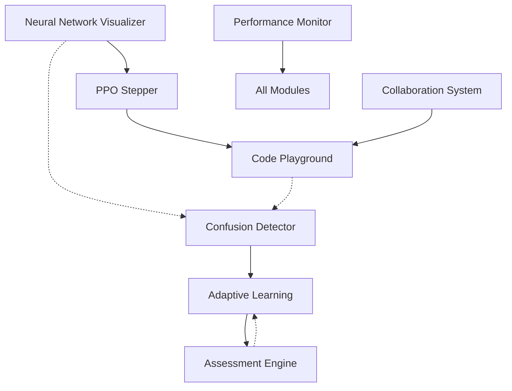

# Key Modules & Critical Success Factors

## Critical Success Factors

### 1. **Engagement & Retention**
- **Interactive First**: Every concept must have an interactive element
- **Immediate Feedback**: Real-time validation and guidance
- **Progressive Difficulty**: Adaptive learning paths based on performance
- **Gamification**: Achievements, streaks, and social features

### 2. **Learning Effectiveness**
- **Multi-Modal Learning**: Visual, textual, and hands-on approaches
- **Confusion Detection**: Proactive intervention when students struggle
- **Practical Application**: Real coding exercises, not just theory
- **Peer Learning**: Community features and collaboration

### 3. **Technical Excellence**
- **Performance**: Smooth animations and fast load times
- **Reliability**: Robust error handling and offline capabilities
- **Scalability**: Architecture that supports thousands of concurrent users
- **Accessibility**: Full support for diverse learners

## Core Module Specifications

### 1. Interactive Neural Network Visualizer

#### Purpose
Enable students to see and manipulate neural networks in real-time, understanding how data flows through PPO's actor-critic architecture.

#### Key Features
```typescript
interface NeuralNetworkVisualizer {
  // Core visualization
  renderNetwork(config: NetworkConfig): void;
  animateForwardPass(input: Tensor): Animation;
  animateBackpropagation(gradients: Tensor): Animation;
  
  // Interactivity
  onNeuronClick(callback: (neuron: Neuron) => void): void;
  onWeightHover(callback: (weight: Weight) => void): void;
  allowWeightManipulation(enabled: boolean): void;
  
  // Educational overlays
  showActivationValues(show: boolean): void;
  showGradientFlow(show: boolean): void;
  highlightCriticalPath(enabled: boolean): void;
  
  // Performance
  useWebGLAcceleration: boolean;
  maxNeuronsBeforeSimplification: number;
}
```

#### Implementation Priority: **CRITICAL**
- This is the centerpiece of visual learning
- Directly impacts understanding of core concepts
- Reused across multiple chapters

### 2. PPO Algorithm Stepper

#### Purpose
Allow students to step through PPO algorithm execution, seeing exactly what happens at each stage.

#### Key Features
```python
class PPOStepper:
    def __init__(self, environment, policy, value_function):
        self.env = environment
        self.policy = policy
        self.value = value_function
        self.history = []
        self.breakpoints = set()
    
    def step_rollout(self) -> RolloutStep:
        """Execute one environment step with full visibility"""
        state = self.env.get_state()
        action_probs = self.policy(state)
        action = self.sample_action(action_probs)
        
        # Store all intermediate values
        step_data = RolloutStep(
            state=state,
            action_probs=action_probs,
            selected_action=action,
            value_estimate=self.value(state)
        )
        
        # Execute in environment
        next_state, reward, done = self.env.step(action)
        step_data.reward = reward
        step_data.next_state = next_state
        
        self.history.append(step_data)
        return step_data
    
    def step_update(self) -> UpdateStep:
        """Execute one gradient update with full visibility"""
        # Calculate advantages
        advantages = self.calculate_advantages()
        
        # Compute policy ratio
        ratio = self.compute_ratio()
        
        # Apply clipping
        clipped_ratio = self.apply_clipping(ratio)
        
        # Calculate loss
        loss = self.compute_loss(clipped_ratio, advantages)
        
        # Store all computations
        return UpdateStep(
            advantages=advantages,
            ratio=ratio,
            clipped_ratio=clipped_ratio,
            loss=loss,
            gradients=self.compute_gradients(loss)
        )
```

#### Implementation Priority: **CRITICAL**
- Core to understanding PPO mechanics
- Enables debugging and experimentation
- Foundation for many exercises

### 3. Confusion Detection Engine

#### Purpose
Identify when students are struggling and provide targeted interventions.

#### Key Features
```typescript
class ConfusionDetector {
  private indicators: ConfusionIndicator[] = [
    new RapidBackNavigation(),
    new RepeatedHovers(),
    new LongPauses(),
    new FailedAttempts(),
    new HelpButtonClicks()
  ];
  
  private interventions: Map<ConfusionType, Intervention> = new Map([
    [ConfusionType.CONCEPTUAL, new ConceptualClarification()],
    [ConfusionType.TECHNICAL, new TechnicalAssistance()],
    [ConfusionType.MATHEMATICAL, new MathematicalExplanation()],
    [ConfusionType.IMPLEMENTATION, new CodeExample()]
  ]);
  
  detectConfusion(userBehavior: UserBehavior): ConfusionState {
    const scores = this.indicators.map(i => i.evaluate(userBehavior));
    const confusionType = this.classifyConfusion(scores);
    
    if (confusionType !== ConfusionType.NONE) {
      return {
        type: confusionType,
        confidence: this.calculateConfidence(scores),
        suggestedIntervention: this.interventions.get(confusionType)
      };
    }
    
    return ConfusionState.NONE;
  }
}
```

#### Implementation Priority: **HIGH**
- Directly impacts learning effectiveness
- Reduces dropout rates
- Personalizes learning experience

### 4. Interactive Code Playground

#### Purpose
Provide a safe, guided environment for implementing PPO components with real-time feedback.

#### Key Features
```typescript
interface CodePlayground {
  // Editor features
  editor: MonacoEditor;
  language: 'python' | 'javascript';
  theme: 'light' | 'dark';
  
  // Execution environment
  runtime: {
    type: 'pyodide' | 'docker' | 'serverless';
    timeout: number;
    memoryLimit: string;
  };
  
  // Educational features
  testSuite: TestCase[];
  hints: ProgressiveHint[];
  solutionRevealer: SolutionRevealer;
  
  // Feedback system
  linter: CodeLinter;
  performanceAnalyzer: PerformanceAnalyzer;
  styleChecker: StyleChecker;
  
  // Collaboration
  shareCode: () => ShareableLink;
  pairProgramming: PairProgrammingSession;
}
```

#### Implementation Priority: **CRITICAL**
- Hands-on learning is essential
- Practical skills development
- Immediate feedback loop

### 5. Adaptive Learning System

#### Purpose
Personalize the learning experience based on individual progress and learning style.

#### Key Features
```python
class AdaptiveLearningEngine:
    def __init__(self):
        self.student_model = StudentModel()
        self.content_graph = ContentGraph()
        self.recommendation_engine = RecommendationEngine()
    
    def update_student_model(self, interaction: Interaction):
        """Update understanding of student's knowledge state"""
        self.student_model.update(
            concept=interaction.concept,
            performance=interaction.performance,
            time_spent=interaction.duration,
            help_used=interaction.help_requested
        )
    
    def get_next_content(self) -> Content:
        """Recommend next piece of content"""
        knowledge_gaps = self.student_model.identify_gaps()
        prerequisites_met = self.student_model.check_prerequisites()
        
        return self.recommendation_engine.recommend(
            gaps=knowledge_gaps,
            prerequisites=prerequisites_met,
            learning_style=self.student_model.learning_style,
            difficulty_preference=self.student_model.preferred_difficulty
        )
    
    def adjust_difficulty(self, current_performance: Performance) -> Difficulty:
        """Dynamically adjust content difficulty"""
        if current_performance.success_rate > 0.9:
            return Difficulty.increase(self.current_difficulty)
        elif current_performance.success_rate < 0.6:
            return Difficulty.decrease(self.current_difficulty)
        return self.current_difficulty
```

#### Implementation Priority: **HIGH**
- Personalizes experience
- Improves completion rates
- Optimizes learning efficiency

### 6. Real-time Collaboration System

#### Purpose
Enable students to learn together through pair programming, group projects, and peer assistance.

#### Key Features
```typescript
class CollaborationSystem {
  // Real-time code sharing
  codeShare: {
    createSession(): SessionID;
    joinSession(id: SessionID): void;
    syncChanges(changes: CodeChange[]): void;
    cursorTracking: boolean;
  };
  
  // Voice/video chat
  communication: {
    startVoiceCall(peer: UserID): void;
    startVideoCall(peer: UserID): void;
    screenShare(): void;
  };
  
  // Collaborative tools
  tools: {
    sharedWhiteboard: Whiteboard;
    conceptMapping: ConceptMapTool;
    codeReview: CodeReviewTool;
  };
  
  // Study groups
  groups: {
    create(name: string, topic: Topic): Group;
    join(groupId: GroupID): void;
    scheduleSession(time: Date): void;
    trackProgress(): GroupProgress;
  };
}
```

#### Implementation Priority: **MEDIUM**
- Enhances engagement
- Peer learning benefits
- Community building

### 7. Assessment Engine

#### Purpose
Evaluate student understanding through varied, practical assessments that test real skills.

#### Key Features
```python
class AssessmentEngine:
    def __init__(self):
        self.question_bank = QuestionBank()
        self.code_evaluator = CodeEvaluator()
        self.plagiarism_detector = PlagiarismDetector()
        
    def generate_assessment(self, config: AssessmentConfig) -> Assessment:
        """Create personalized assessment based on student progress"""
        questions = self.question_bank.select(
            topics=config.topics,
            difficulty=config.difficulty,
            types=config.question_types,
            avoid_recent=config.student.recent_questions
        )
        
        return Assessment(
            questions=questions,
            time_limit=config.time_limit,
            allow_references=config.open_book,
            grading_rubric=self.generate_rubric(questions)
        )
    
    async def evaluate_submission(self, submission: Submission) -> Result:
        """Evaluate student submission with detailed feedback"""
        # Check for plagiarism
        plagiarism_score = await self.plagiarism_detector.check(submission.code)
        
        # Run automated tests
        test_results = await self.code_evaluator.run_tests(
            submission.code,
            self.get_test_suite(submission.question_id)
        )
        
        # Analyze code quality
        quality_metrics = self.analyze_code_quality(submission.code)
        
        # Generate feedback
        feedback = self.generate_feedback(
            test_results,
            quality_metrics,
            submission.approach
        )
        
        return Result(
            score=self.calculate_score(test_results, quality_metrics),
            feedback=feedback,
            plagiarism_flag=plagiarism_score > 0.8
        )
```

#### Implementation Priority: **HIGH**
- Validates learning outcomes
- Provides certification value
- Enables progress tracking

### 8. Performance Monitoring System

#### Purpose
Track system performance and learning metrics to ensure quality experience.

#### Key Features
```typescript
interface PerformanceMonitor {
  // Technical metrics
  technical: {
    pageLoadTime: Metric;
    apiLatency: Metric;
    renderingFPS: Metric;
    errorRate: Metric;
    availability: Metric;
  };
  
  // Learning metrics
  learning: {
    completionRate: Metric;
    averageScore: Metric;
    timeToMastery: Metric;
    engagementScore: Metric;
    satisfactionRating: Metric;
  };
  
  // Real-time dashboards
  dashboards: {
    technical: Dashboard;
    educational: Dashboard;
    business: Dashboard;
  };
  
  // Alerting
  alerts: {
    performance: Alert[];
    learning: Alert[];
    system: Alert[];
  };
}
```

#### Implementation Priority: **MEDIUM**
- Ensures quality
- Identifies issues early
- Guides improvements

## Module Integration Map



## Implementation Roadmap

### Phase 1: Foundation (Weeks 1-4)
1. Neural Network Visualizer (basic)
2. Code Playground (basic)
3. PPO Stepper (core functionality)

### Phase 2: Intelligence (Weeks 5-8)
1. Confusion Detection Engine
2. Adaptive Learning System
3. Neural Network Visualizer (advanced features)

### Phase 3: Assessment (Weeks 9-12)
1. Assessment Engine
2. Code Playground (advanced features)
3. Performance Monitoring

### Phase 4: Collaboration (Weeks 13-16)
1. Collaboration System
2. Integration testing
3. Performance optimization

## Risk Mitigation

### Technical Risks
- **Performance Issues**: Use WebGL, implement lazy loading
- **Scalability**: Design for horizontal scaling from start
- **Browser Compatibility**: Progressive enhancement approach

### Educational Risks
- **Content Too Complex**: Multiple explanation levels
- **Low Engagement**: Gamification and social features
- **Varying Skill Levels**: Adaptive difficulty system

### Operational Risks
- **High Development Cost**: Phased approach, MVP first
- **Maintenance Burden**: Comprehensive testing, monitoring
- **Security Concerns**: Sandboxed execution, regular audits

## Success Metrics

### Technical KPIs
- Page load time < 2 seconds
- 99.9% uptime
- < 1% error rate
- 60 FPS animations

### Educational KPIs
- 80% completion rate
- 90% assessment pass rate
- 4.5+ satisfaction score
- 70% active after 30 days

### Business KPIs
- 10,000 active learners in 6 months
- 50% conversion to paid tier
- 30% referral rate
- 90% employer satisfaction

These key modules form the foundation of an effective, engaging PPO learning platform that can scale to serve thousands of students while maintaining high educational standards.